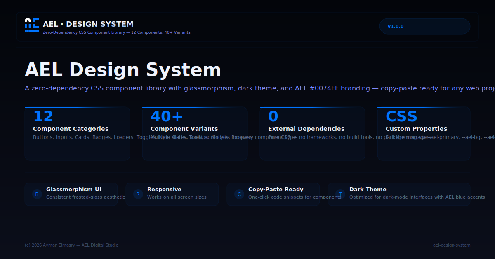

# AEL Design System

<p align="center">
  
</p>

**A zero-dependency CSS component library** — 12 components with 40+ variants. Built with the AEL design language: glassmorphism, #0074FF accents, and dark theme. Copy-paste ready for any web project.

## Components

| Category | Components |
|----------|-----------|
| **Buttons** | Primary, Secondary, Ghost, Icon |
| **Inputs** | Text Input, Select, Textarea |
| **Cards** | Glass Card, Hover Card |
| **Badges** | Default, Primary, Success, Warning, Danger, Gold |
| **Tags** | Reusable tag chips |
| **Loaders** | Spinner (3 sizes), Dots, Skeleton |
| **Toggles** | Toggle Switch, Range Slider, Checkbox, Radio |
| **Navigation** | Nav Tabs |
| **Alerts** | Info, Success, Warning, Danger |

## Features

- **Zero Dependencies**: Pure CSS, no frameworks required
- **40+ Variants**: Multiple states and sizes for each component
- **CSS Variables**: Full theming via custom properties
- **Copy-Paste**: One-click code snippets for every component
- **Dark Theme**: Optimized for dark-mode interfaces
- **Glassmorphism**: Consistent frosted-glass aesthetic
- **Responsive**: Works on all screen sizes

## Tech Stack

- **HTML5** — Semantic structure
- **CSS3** — Custom properties, flexbox, grid, animations
- **JavaScript** — Vanilla JS for interactivity (optional)

## Live Demo

https://aymanelmasryael.github.io/ael-design-system/

## Quick Start

```html
<link rel="stylesheet" href="ael_design_system.css">
```

Or copy individual component code from the **Code** section.

## Author

**Ayman Elmasry** — AEL Digital Studio

---

_© 2026 AEL Digital Studio. All rights reserved._
